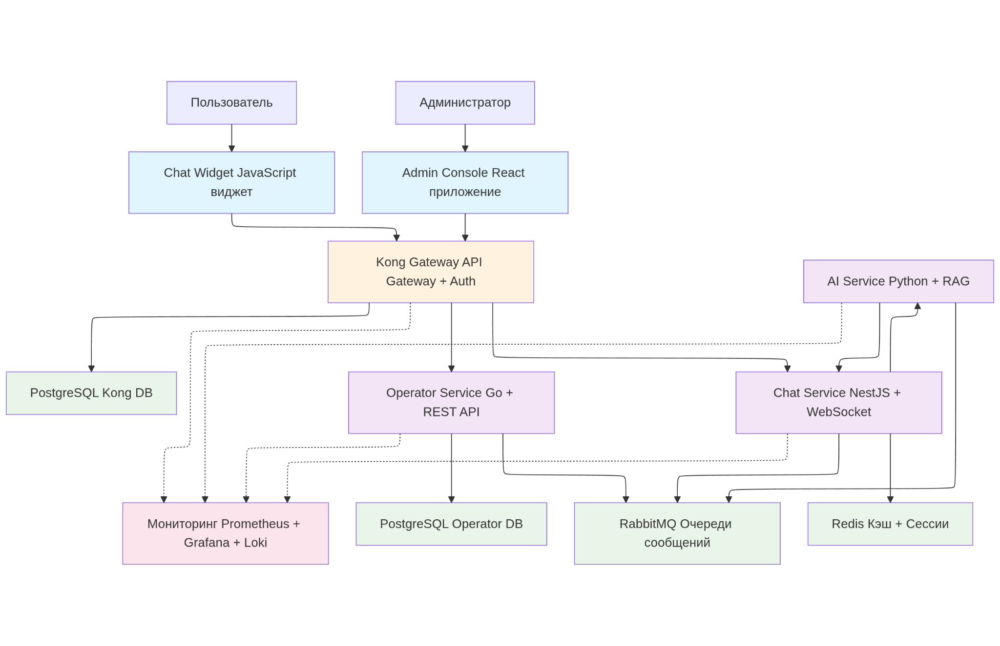
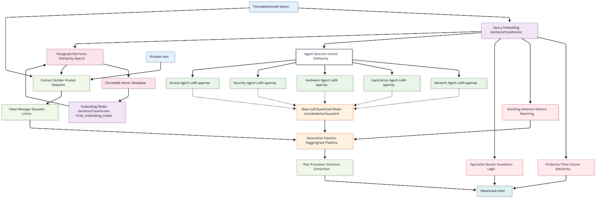

# AI-Powered Customer Support Platform

Интеллектуальная платформа поддержки клиентов с RAG-ботом, микросервисной архитектурой и полным мониторингом.

## 🚀 Как запустить за 5 минут

### Предварительные требования
- Docker и Docker Compose
- 8GB+ RAM
- NVIDIA GPU (recommended 12GB vram)

### Быстрый старт
```bash
# 1. Клонируйте репозиторий
git clone https://github.com/LeoCristt/Hackathon.git
cd Hackathon

# 2. Запустите все сервисы
cd backend
docker-compose up --build

# 3. Дождитесь инициализации (2-3 минуты)
docker-compose logs -f kong-setup

# 4. Запустите сервер с демо страницей (опционально,
# т. к. виджет может интегрироаться в любые страницы через <script>)


# 5. Откройте приложения
# Демо страница с виджетом чата: http://localhost:3300 
# Админ панель: http://localhost:5173
# Мониторинг: http://localhost:3000 (admin/admin)
```

## 🏗️ Архитектура системы



### 🤖 Рзвёрнутая архитектура ai-service



## 🔧 Компоненты системы

### Frontend
- **Chat Widget** (Port 4000) - Встраиваемый виджет чата для сайтов
- **Admin Console** (Port 5173) - React-приложение для управления

### Backend Services
- **Kong API Gateway** (Port 8000) - Единая точка входа, маршрутизация
- **Chat Service** (Port 3001) - Node.js/NestJS WebSocket сервер
- **Operator Service** (Port 8080) - Go сервис управления пользователями
- **AI Service** - Python RAG-бот с ChromaDB

### Data Layer
- **PostgreSQL** (Port 5433) - Пользователи и чаты
- **ChromaDB** (Port 8002) - Векторная база знаний
- **RabbitMQ** (Port 5672) - Очереди сообщений
- **Redis** (Port 6379) - Кэш и сессии

### Monitoring
- **Prometheus** (Port 9090) - Сбор метрик
- **Grafana** (Port 3000) - Дашборды и визуализация
- **Loki** (Port 3100) - Централизованные логи

## 📡 API Endpoints

### Chat API
```bash
# WebSocket подключение
ws://localhost:8000/socket.io

# REST API для чатов
GET    /api/chats          # Список чатов
POST   /api/chats          # Создать чат
GET    /api/chats/:id      # Получить чат
```

### Auth API
```bash
POST   /api/auth/login     # Авторизация
POST   /api/auth/register  # Регистрация
GET    /api/user/profile   # Профиль пользователя
```

### Admin API
```bash
GET    /api/admin/stats    # Статистика системы
GET    /api/admin/users    # Управление пользователями
```

## 🧪 Типовые запросы

### 1. Подключение к чату
```javascript
import io from 'socket.io-client';

const socket = io('http://localhost:8000', {
  path: '/socket.io',
  transports: ['websocket']
});

socket.emit('join_chat', { chatId: 'chat_123' });
socket.emit('send_message', { 
  message: 'Привет! Как дела?',
  chatId: 'chat_123'
});
```

### 2. Создание нового чата
```bash
curl -X POST http://localhost:8000/api/chats \
  -H "Content-Type: application/json" \
  -d '{"title": "Новый чат", "userId": "user_123"}'
```

### 3. Авторизация
```bash
curl -X POST http://localhost:8000/api/auth/login \
  -H "Content-Type: application/json" \
  -d '{"email": "user@example.com", "password": "password123"}'
```

### 4. Получение статистики
```bash
curl -X GET http://localhost:8000/api/admin/stats \
  -H "Authorization: Bearer <token>"
```

## 🔍 Мониторинг и метрики

### Grafana Dashboards
- **AI Performance** - Производительность RAG-бота
- **System Health** - Состояние всех сервисов  
- **Chat Analytics** - Аналитика чатов и пользователей

### Ключевые метрики
- `ai_requests_total` - Количество AI запросов
- `ai_request_duration_seconds` - Время обработки
- `ai_tokens_used` - Использование токенов
- `chat_active_connections` - Активные подключения

### Логи
```bash
# Просмотр логов AI сервиса
docker-compose logs -f ai-service

# Все логи системы
docker-compose logs -f
```

## 🛠️ Разработка

### Структура проекта
```
Hackathon/
├── backend/
│   ├── ai-service/          # Python RAG-бот
│   ├── chat-service/        # Node.js WebSocket сервер
│   ├── operator-service/    # Go пользовательский сервис
│   ├── docker-compose.yml   # Оркестрация сервисов
│   └── kong-plugins/        # Кастомные плагины Kong
├── frontend/
│   ├── ac-frontend/         # React админ панель
│   ├── hakaton-frontend/    # Виджет чата
│   └── demo-page/           # Демо страница
└── docs/                    # Документация
```

## 🔐 Безопасность

- JWT токены для авторизации
- CORS настроен для всех доменов
- Rate limiting через Kong
- Валидация доменов для виджетов
- Шифрование паролей bcrypt

## 📊 Производительность

- **AI ответы**: < 8 сек
- **WebSocket**: Real-time
- **Concurrent users**: 1000+
- **Vector search**: < 100ms
- **Cache hit ratio**: 95%+