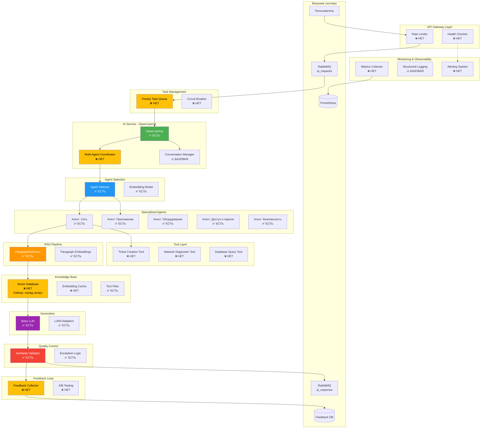

# Архитектура AI-сервиса: Мультиагентная система с RAG

## 📊 Диаграмма компонентов системы

```mermaid
graph TB
    subgraph "Внешние системы"
        RMQ[RabbitMQ<br/>ai_requests]
        RMQ_OUT[RabbitMQ<br/>ai_response]
        USER[Пользователь через<br/>Chat Service]
    end

    subgraph "AI Service - Оркестратор"
        ORCHESTRATOR[Оркестратор<br/>process_query]
        CALLBACK[RabbitMQ Consumer<br/>callback]

        CALLBACK -->|Получает запрос| ORCHESTRATOR
    end

    subgraph "Routing Layer - Выбор агента"
        AGENT_SEL[Agent Selector<br/>select_agent]
        EMB_ROUTER[Embedding Model<br/>frida_embedding_model]

        ORCHESTRATOR --> AGENT_SEL
        AGENT_SEL --> EMB_ROUTER
    end

    subgraph "Специализированные агенты"
        AGENT1[Агент: Сеть<br/>LoRA адаптер]
        AGENT2[Агент: Приложение<br/>LoRA адаптер]
        AGENT3[Агент: Оборудование<br/>LoRA адаптер]
        AGENT4[Агент: Доступ и пароли<br/>LoRA адаптер]
        AGENT5[Агент: Безопасность<br/>LoRA адаптер]

        AGENT_SEL -.->|similarity > 0.25| AGENT1
        AGENT_SEL -.->|similarity > 0.25| AGENT2
        AGENT_SEL -.->|similarity > 0.25| AGENT3
        AGENT_SEL -.->|similarity > 0.25| AGENT4
        AGENT_SEL -.->|similarity > 0.25| AGENT5
    end

    subgraph "Knowledge Base - Хранилище знаний"
        KB1[Сеть.txt<br/>База знаний]
        KB2[Приложение.txt<br/>База знаний]
        KB3[Оборудование.txt<br/>База знаний]
        KB4[Доступ и пароли.txt<br/>База знаний]
        KB5[Безопасность.txt<br/>База знаний]

        AGENT1 --> KB1
        AGENT2 --> KB2
        AGENT3 --> KB3
        AGENT4 --> KB4
        AGENT5 --> KB5
    end

    subgraph "RAG Pipeline - Поиск контекста"
        RETRIEVER[ParagraphRetriever<br/>Векторный поиск]
        PARA_EMB[Paragraph Embeddings<br/>Векторные представления]
        QUERY_EMB[Query Embedding<br/>Векторизация запроса]

        ORCHESTRATOR --> RETRIEVER
        RETRIEVER --> QUERY_EMB
        RETRIEVER --> PARA_EMB
        KB1 -.-> PARA_EMB
        KB2 -.-> PARA_EMB
        KB3 -.-> PARA_EMB
        KB4 -.-> PARA_EMB
        KB5 -.-> PARA_EMB
    end

    subgraph "Generation Layer - Генерация ответов"
        LLM[Base LLM<br/>quantized_model]
        LORA_ADAPTER[LoRA Адаптер<br/>выбранного агента]
        PIPELINE[HuggingFace Pipeline<br/>text-generation]

        RETRIEVER -->|Контекст + История| PIPELINE
        PIPELINE --> LLM
        PIPELINE --> LORA_ADAPTER
        AGENT1 -.->|Загружает адаптер| LORA_ADAPTER
        AGENT2 -.->|Загружает адаптер| LORA_ADAPTER
        AGENT3 -.->|Загружает адаптер| LORA_ADAPTER
        AGENT4 -.->|Загружает адаптер| LORA_ADAPTER
        AGENT5 -.->|Загружает адаптер| LORA_ADAPTER
    end

    subgraph "Quality Control - Контроль качества"
        VALIDATOR[Similarity Validator<br/>Проверка релевантности]
        ESCALATION[Escalation Logic<br/>Передача специалисту]

        PIPELINE --> VALIDATOR
        VALIDATOR -->|similarity < 0.5| ESCALATION
    end

    subgraph "Response Processing - Обработка ответа"
        SENTENCE[Sentence Extractor<br/>razdel sentenize]
        FORMATTER[Response Formatter<br/>JSON формат]

        VALIDATOR --> SENTENCE
        SENTENCE --> FORMATTER
        ESCALATION --> FORMATTER
    end

    USER -->|Запрос| RMQ
    RMQ --> CALLBACK
    FORMATTER -->|Ответ + isManager| RMQ_OUT
    RMQ_OUT --> USER

    style ORCHESTRATOR fill:#4CAF50,color:#fff
    style AGENT_SEL fill:#2196F3,color:#fff
    style RETRIEVER fill:#FF9800,color:#fff
    style LLM fill:#9C27B0,color:#fff
    style VALIDATOR fill:#F44336,color:#fff
```



## 🏗️ Текущая архитектура

### ✅ Что уже реализовано:

#### 1. **Оркестратор (Orchestrator)**
- **Файл**: `model.py` → функция `process_query()`
- **Функции**:
  - Координация всех компонентов
  - Управление потоком обработки запроса
  - Обработка истории чата
  - Управление лимитами токенов

#### 2. **Routing Layer - Выбор агента**
- **Компонент**: `ParagraphRetriever.select_agent()`
- **Механизм**: Векторное сходство через embedding model
- **Агенты** (5 специализированных):
  1. Сеть
  2. Приложение
  3. Оборудование
  4. Доступ и пароли
  5. Безопасность
- **Порог**: similarity_threshold = 0.25

#### 3. **Хранилище знаний (Knowledge Base)**
- **Формат**: Текстовые файлы (.txt)
- **Структура**: Абзацы, разделённые переносами строк
- **Файлы**:
  - Сеть.txt (49KB)
  - Приложение.txt (47KB)
  - Оборудование.txt (50KB)
  - Доступ и пароли.txt (47KB)
  - Безопасность.txt (47KB)

#### 4. **RAG Pipeline**
- **Retriever**: `ParagraphRetriever` (кастомный LangChain retriever)
- **Embedding Model**: SentenceTransformer (frida_embedding_model)
- **Векторизация**:
  - Документы: prompt_name="search_document"
  - Запросы: prompt_name="search_query"
- **Поиск**: Cosine similarity
- **Порог релевантности**: 0.25

#### 5. **Специализированные агенты**
- **Базовая модель**: quantized_model (общая для всех)
- **Адаптеры**: LoRA адаптеры для каждой специализации
- **Обучение**: Файл `lora.py` для дообучения
- **Параметры LoRA**:
  - rank (r) = 64
  - lora_alpha = 128
  - lora_dropout = 0.1

#### 6. **Управление контекстом**
- **Динамические лимиты токенов**:
  - Максимум: 8192 токена
  - Резерв на вывод: 150 токенов
  - Промпт: ~100 токенов
- **Обрезка**:
  - Приоритет 1: Обрезка старой истории
  - Приоритет 2: Обрезка контекста (fallback)

#### 7. **Quality Control - Контроль качества**
- **Проверка приветствий**: similarity >= 0.7
- **Проверка "Передай специалисту"**: similarity >= 0.7
- **Проверка релевантности ответа**: similarity >= 0.5 с контекстом
- **Эскалация**: Автоматическая передача специалисту

#### 8. **Интеграция с RabbitMQ**
- **Входная очередь**: `ai_requests`
- **Выходная очередь**: `ai_response`
- **Формат сообщений**: JSON
- **Поля запроса**: chatId, message, messageHistory
- **Поля ответа**: chatId, answer, botUsername, isManager

#### 9. **Post-processing**
- **Извлечение предложений**: razdel.sentenize
- **Ограничение**: Одно предложение в ответе
- **Форматирование**: JSON response

---

## ❌ Что отсутствует и рекомендуется добавить:

### 1. **Очередь задач (Task Queue)**
**Статус**: ❌ Отсутствует

**Проблема**:
- Нет приоритизации запросов
- Нет управления нагрузкой
- Один consumer для RabbitMQ

**Рекомендация**:
```python
# Добавить Priority Queue для задач
import heapq
from dataclasses import dataclass, field
from typing import Any

@dataclass(order=True)
class PrioritizedTask:
    priority: int
    timestamp: float = field(compare=False)
    chat_id: str = field(compare=False)
    query: str = field(compare=False)
    history: list = field(compare=False)

class TaskQueue:
    def __init__(self):
        self.queue = []

    def add_task(self, task: PrioritizedTask):
        heapq.heappush(self.queue, task)

    def get_task(self):
        return heapq.heappop(self.queue) if self.queue else None
```

**Преимущества**:
- VIP пользователи получают приоритет
- Срочные запросы обрабатываются быстрее
- Балансировка нагрузки

---

### 2. **Мониторинг и метрики (Observability)**
**Статус**: ❌ Отсутствует

**Проблема**:
- Нет метрик производительности
- Нет отслеживания ошибок
- Нет дашбордов

**Рекомендация**:
```python
# Добавить Prometheus метрики
from prometheus_client import Counter, Histogram, Gauge

# Метрики
request_counter = Counter('ai_requests_total', 'Total AI requests')
response_time = Histogram('ai_response_time_seconds', 'Response time')
active_agents = Gauge('ai_active_agents', 'Active agents count')
escalation_rate = Counter('ai_escalations_total', 'Escalations to human')
```

**Компоненты**:
- Prometheus для сбора метрик
- Grafana для визуализации
- Loki для логов

---

### 3. **Кэш векторных представлений**
**Статус**: ⚠️ Частично реализовано

**Проблема**:
- Paragraph embeddings вычисляются каждый раз при выборе агента
- Повторные вычисления для одних и тех же параграфов

**Рекомендация**:
```python
import pickle
import hashlib

class EmbeddingCache:
    def __init__(self, cache_dir="./embedding_cache"):
        self.cache_dir = cache_dir
        os.makedirs(cache_dir, exist_ok=True)

    def get_cache_key(self, text: str, model_name: str) -> str:
        content = f"{text}_{model_name}"
        return hashlib.md5(content.encode()).hexdigest()

    def get(self, text: str, model_name: str):
        key = self.get_cache_key(text, model_name)
        cache_file = os.path.join(self.cache_dir, f"{key}.pkl")
        if os.path.exists(cache_file):
            with open(cache_file, 'rb') as f:
                return pickle.load(f)
        return None

    def set(self, text: str, model_name: str, embedding):
        key = self.get_cache_key(text, model_name)
        cache_file = os.path.join(self.cache_dir, f"{key}.pkl")
        with open(cache_file, 'wb') as f:
            pickle.dump(embedding, f)
```

---

### 4. **Векторная база данных (Vector DB)**
**Статус**: ❌ Отсутствует

**Проблема**:
- Embeddings хранятся в памяти (списки numpy arrays)
- Нет персистентности
- Нет оптимизации поиска (HNSW, IVF)

**Рекомендация**: Использовать **ChromaDB** или **Qdrant**

```python
import chromadb
from chromadb.config import Settings

class VectorStore:
    def __init__(self, persist_directory="./chroma_db"):
        self.client = chromadb.Client(Settings(
            chroma_db_impl="duckdb+parquet",
            persist_directory=persist_directory
        ))
        self.collections = {}

    def create_collection(self, agent_name: str, paragraphs: list, embeddings: list):
        collection = self.client.create_collection(
            name=agent_name,
            metadata={"description": f"Knowledge base for {agent_name}"}
        )
        collection.add(
            embeddings=embeddings.tolist(),
            documents=paragraphs,
            ids=[f"{agent_name}_{i}" for i in range(len(paragraphs))]
        )
        self.collections[agent_name] = collection

    def search(self, agent_name: str, query_embedding, top_k=1):
        collection = self.collections.get(agent_name)
        if not collection:
            return None
        results = collection.query(
            query_embeddings=[query_embedding.tolist()],
            n_results=top_k
        )
        return results
```

**Преимущества**:
- Персистентность данных
- Быстрый поиск (ANN алгоритмы)
- Масштабируемость

---

### 5. **Инструментальные агенты (Tool-using Agents)**
**Статус**: ❌ Отсутствует

**Проблема**:
- Агенты не могут выполнять действия
- Нет интеграции с внешними системами
- Нет доступа к API

**Рекомендация**: Добавить **LangChain Tools**

```python
from langchain.tools import BaseTool
from typing import Optional, Type
from pydantic import BaseModel, Field

class TicketCreationInput(BaseModel):
    title: str = Field(description="Заголовок тикета")
    description: str = Field(description="Описание проблемы")
    priority: str = Field(description="Приоритет: low, medium, high")

class TicketCreationTool(BaseTool):
    name = "create_ticket"
    description = "Создаёт тикет в системе поддержки"
    args_schema: Type[BaseModel] = TicketCreationInput

    def _run(self, title: str, description: str, priority: str) -> str:
        # Интеграция с системой тикетов
        ticket_id = self._create_in_system(title, description, priority)
        return f"Создан тикет #{ticket_id}"

class NetworkDiagnosticTool(BaseTool):
    name = "network_diagnostic"
    description = "Проверяет статус сети пользователя"

    def _run(self, user_id: str) -> str:
        # Проверка статуса сети
        status = self._check_network(user_id)
        return f"Статус сети: {status}"

# Добавить в агентов
agent_tools = {
    "Сеть": [NetworkDiagnosticTool()],
    "Безопасность": [TicketCreationTool()],
    # ...
}
```

---

### 6. **Feedback Loop - Обратная связь**
**Статус**: ❌ Отсутствует

**Проблема**:
- Нет сбора feedback от пользователей
- Нет улучшения моделей на основе отзывов
- Нет A/B тестирования

**Рекомендация**:
```python
class FeedbackCollector:
    def __init__(self, db_path="./feedback.db"):
        self.db_path = db_path
        self._init_db()

    def _init_db(self):
        # SQLite или PostgreSQL для хранения feedback
        pass

    def collect_feedback(self, chat_id: str, query: str, answer: str,
                         rating: int, user_comment: str = None):
        """
        rating: 1-5 звёзд
        """
        feedback = {
            "chat_id": chat_id,
            "query": query,
            "answer": answer,
            "rating": rating,
            "comment": user_comment,
            "timestamp": time.time()
        }
        self._save_to_db(feedback)

    def get_low_rated_queries(self, threshold=3):
        """Возвращает запросы с низким рейтингом для переобучения"""
        return self._query_db(f"SELECT * FROM feedback WHERE rating < {threshold}")
```

**Интеграция с фронтендом**:
- Кнопки "👍 Полезно" / "👎 Не помогло"
- Дополнительное поле для комментариев

---

### 7. **Агент-координатор для сложных запросов**
**Статус**: ❌ Отсутствует

**Проблема**:
- Нет обработки мультидоменных запросов
- Например: "Проблема с доступом к приложению через сеть"
  - Требует агентов: "Сеть" + "Приложение" + "Доступ и пароли"

**Рекомендация**: Multi-agent collaboration

```python
class CoordinatorAgent:
    def __init__(self, agents: dict):
        self.agents = agents

    def analyze_query_complexity(self, query: str) -> list:
        """Определяет, какие агенты нужны для ответа"""
        required_agents = []
        for agent_name in self.agents.keys():
            score = self._calculate_relevance(query, agent_name)
            if score > 0.3:  # Порог для включения агента
                required_agents.append((agent_name, score))

        # Сортируем по релевантности
        return sorted(required_agents, key=lambda x: x[1], reverse=True)

    def coordinate(self, query: str, message_history: list):
        """Координирует работу нескольких агентов"""
        required = self.analyze_query_complexity(query)

        if len(required) == 1:
            # Простой случай - один агент
            return self._single_agent_response(required[0][0], query, message_history)
        else:
            # Сложный случай - несколько агентов
            return self._multi_agent_response(required, query, message_history)

    def _multi_agent_response(self, agents: list, query: str, history: list):
        """Собирает ответы от нескольких агентов и объединяет"""
        responses = []
        for agent_name, score in agents:
            agent_response = self._query_agent(agent_name, query, history)
            responses.append({
                "agent": agent_name,
                "response": agent_response,
                "confidence": score
            })

        # Синтезируем финальный ответ
        final_answer = self._synthesize_answers(responses, query)
        return final_answer
```

---

### 8. **Conversation State Management**
**Статус**: ⚠️ Базовая реализация

**Проблема**:
- История чата хранится только в запросе
- Нет персистентности между сессиями
- Нет контекста диалога

**Рекомендация**: Использовать Redis для состояния

```python
import redis
import json

class ConversationManager:
    def __init__(self, redis_host='localhost', redis_port=6379):
        self.redis_client = redis.Redis(host=redis_host, port=redis_port)
        self.ttl = 3600  # 1 час

    def save_conversation(self, chat_id: str, message_history: list):
        key = f"conversation:{chat_id}"
        self.redis_client.setex(
            key,
            self.ttl,
            json.dumps(message_history)
        )

    def get_conversation(self, chat_id: str) -> list:
        key = f"conversation:{chat_id}"
        data = self.redis_client.get(key)
        if data:
            return json.loads(data)
        return []

    def save_user_context(self, chat_id: str, context: dict):
        """Сохраняет дополнительный контекст: выбранный агент, тему и т.д."""
        key = f"context:{chat_id}"
        self.redis_client.setex(key, self.ttl, json.dumps(context))
```

---

### 9. **Rate Limiting и защита от злоупотреблений**
**Статус**: ❌ Отсутствует

**Проблема**:
- Нет ограничения на количество запросов
- Возможна DDoS атака на AI сервис

**Рекомендация**:
```python
from datetime import datetime, timedelta

class RateLimiter:
    def __init__(self, redis_client, max_requests=10, window_seconds=60):
        self.redis = redis_client
        self.max_requests = max_requests
        self.window = window_seconds

    def is_allowed(self, chat_id: str) -> bool:
        key = f"rate_limit:{chat_id}"
        current = self.redis.get(key)

        if current is None:
            self.redis.setex(key, self.window, 1)
            return True

        if int(current) >= self.max_requests:
            return False

        self.redis.incr(key)
        return True
```

---

### 10. **Healthcheck и Circuit Breaker**
**Статус**: ❌ Отсутствует

**Проблема**:
- Нет проверки здоровья моделей
- Нет защиты от каскадных сбоев

**Рекомендация**:
```python
from enum import Enum

class ServiceStatus(Enum):
    HEALTHY = "healthy"
    DEGRADED = "degraded"
    DOWN = "down"

class HealthChecker:
    def __init__(self):
        self.failure_count = 0
        self.max_failures = 5
        self.status = ServiceStatus.HEALTHY

    def check_model_health(self) -> ServiceStatus:
        """Проверяет доступность моделей"""
        try:
            # Простой тестовый запрос
            test_query = "Привет"
            result = self._test_inference(test_query)

            if result:
                self.failure_count = 0
                self.status = ServiceStatus.HEALTHY
            else:
                self.failure_count += 1

            if self.failure_count >= self.max_failures:
                self.status = ServiceStatus.DOWN
            elif self.failure_count > 0:
                self.status = ServiceStatus.DEGRADED

            return self.status
        except Exception as e:
            logger.error(f"Health check failed: {e}")
            self.status = ServiceStatus.DOWN
            return self.status
```

---

## 📈 Обновлённая диаграмма с рекомендованными компонентами



## 📋 Приоритизация внедрения

### Высокий приоритет (Must Have):
1. ✅ **Vector Database** - Критично для масштабируемости
2. ✅ **Embedding Cache** - Существенно ускорит работу
3. ✅ **Monitoring & Metrics** - Необходимо для production
4. ✅ **Rate Limiting** - Защита от злоупотреблений

### Средний приоритет (Should Have):
5. ⚠️ **Task Queue** - Улучшит производительность
6. ⚠️ **Conversation Manager** - Улучшит UX
7. ⚠️ **Multi-Agent Coordinator** - Для сложных запросов
8. ⚠️ **Feedback Loop** - Для continuous improvement

### Низкий приоритет (Nice to Have):
9. 🔵 **Tool-using Agents** - Расширенная функциональность
10. 🔵 **A/B Testing** - Оптимизация

---

## 🎯 Заключение

**Текущая система** имеет хорошую базовую архитектуру мультиагентной системы с RAG, но не хватает:
- Персистентности данных (Vector DB)
- Мониторинга и observability
- Защиты от перегрузок
- Инструментов для агентов
- Механизмов обратной связи

**Следующие шаги**:
1. Добавить ChromaDB для векторного хранилища
2. Настроить Prometheus + Grafana
3. Реализовать Rate Limiting
4. Добавить Conversation Manager на Redis
5. Внедрить Feedback Loop

Это превратит систему из proof-of-concept в production-ready решение.
