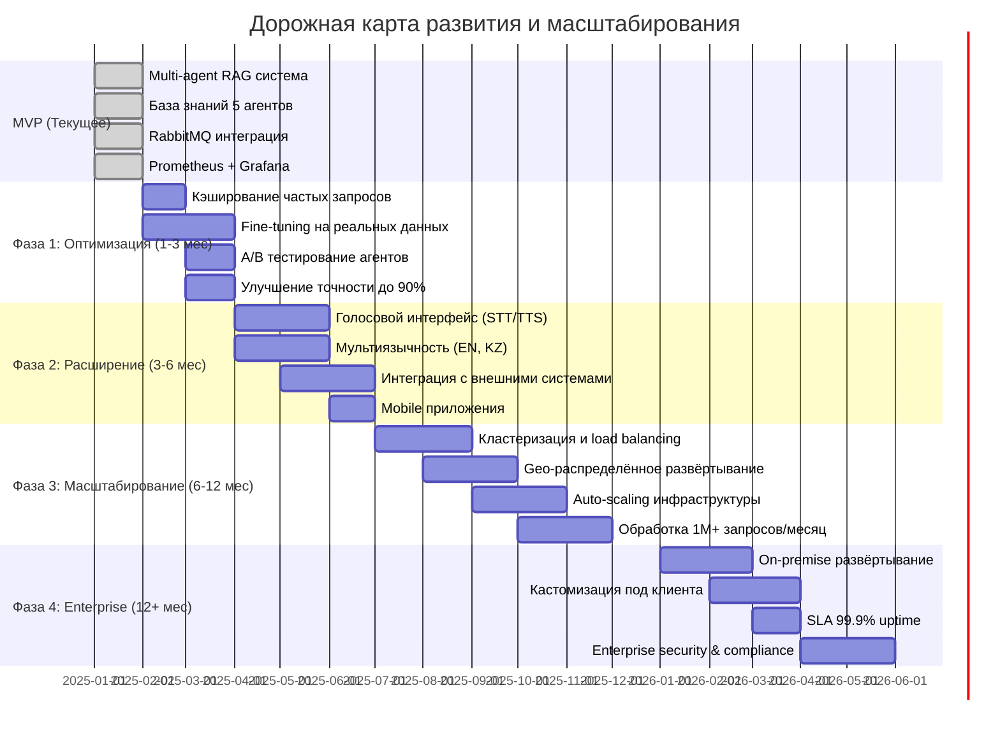
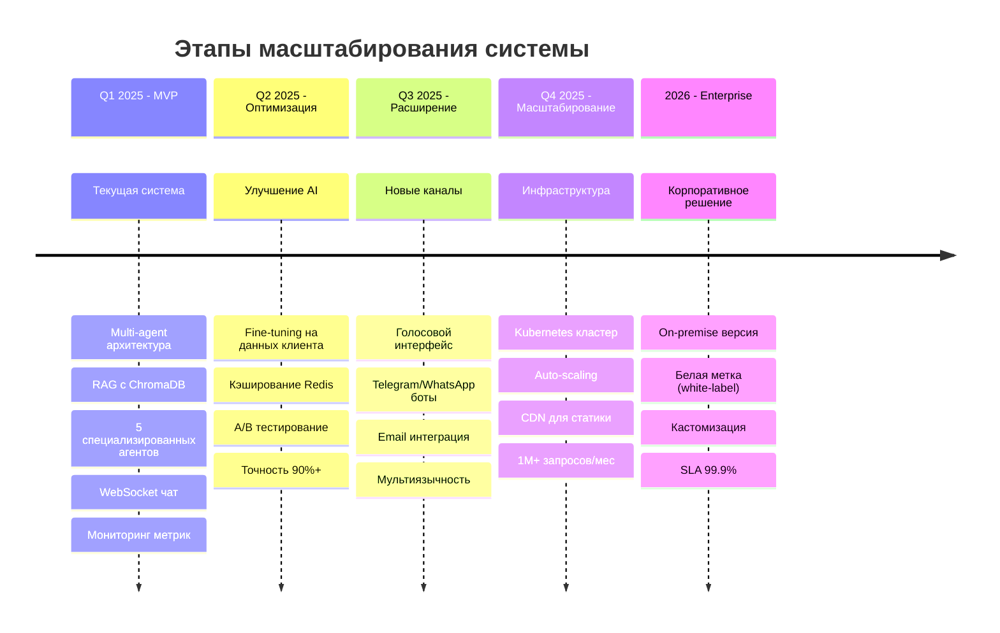
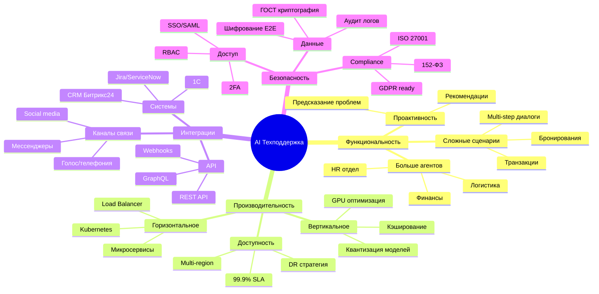
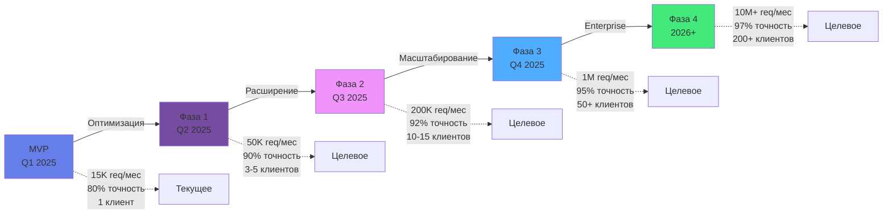
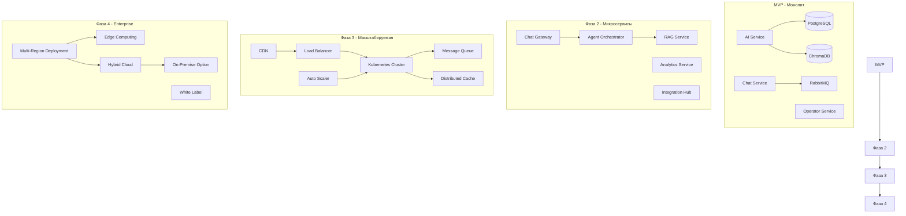
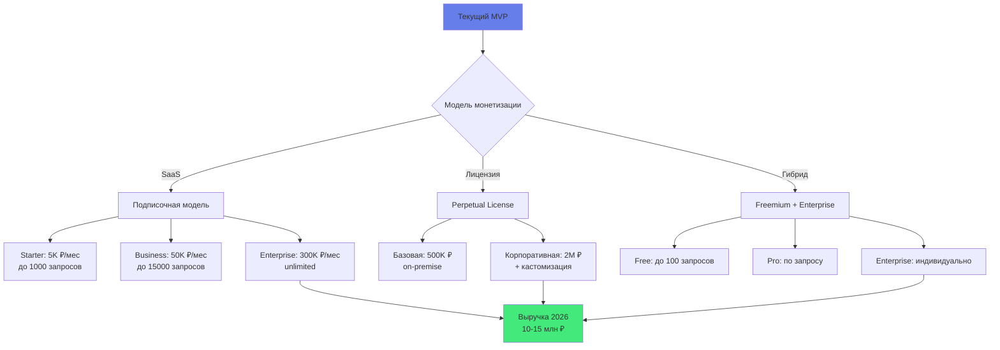
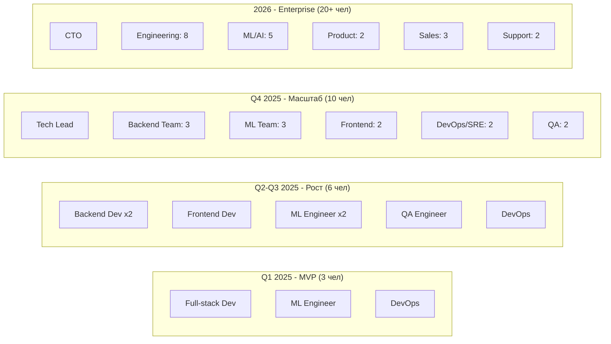
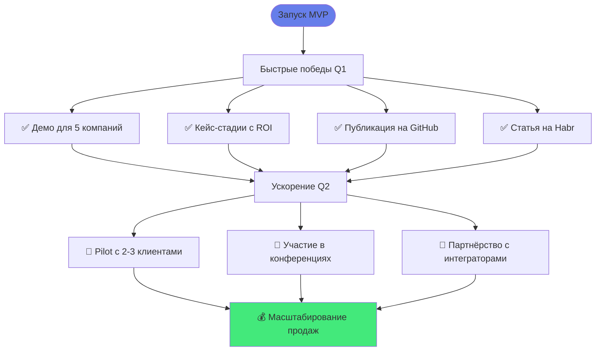

# 🚀 Дорожная карта масштабирования AI-системы техподдержки

## Текущее состояние → Корпоративное решение

---

## 📍 Детальная roadmap по этапам

---

## 🎯 Основные направления масштабирования

---

## 📊 Метрики масштабирования по фазам

---

## 🏗️ Архитектурная эволюция

---

## 💼 Коммерческая модель масштабирования

---

## 🎓 План команды для масштабирования

---

## ⚡ Quick Wins для быстрого роста

---

## 📈 KPI по этапам масштабирования

| Метрика | MVP (Q1) | Фаза 1 (Q2) | Фаза 2 (Q3) | Фаза 3 (Q4) | Enterprise (2026) |
|---------|----------|-------------|-------------|-------------|-------------------|
| **Клиентов** | 1 | 3-5 | 10-15 | 30-50 | 100+ |
| **Запросов/мес** | 15K | 50K | 200K | 1M | 10M+ |
| **Точность AI** | 80% | 90% | 92% | 95% | 97% |
| **Автоматизация** | 80% | 85% | 87% | 90% | 93% |
| **Uptime** | 95% | 98% | 99% | 99.5% | 99.9% |
| **Время ответа** | 3s | 2s | 1.5s | <1s | <0.5s |
| **MRR** | 0 | 150K | 500K | 1.5M | 5M+ |
| **Команда** | 3 | 6 | 10 | 15 | 25+ |

---

## 🎯 Критические факторы успеха

1. **Техническое совершенство**: Точность AI 90%+ обязательна для масштаба
2. **Product-Market Fit**: Валидация с 5+ клиентами до массового выхода
3. **Инфраструктура**: Auto-scaling готовность до пиковых нагрузок
4. **Команда**: Найм ключевых ML/Backend специалистов
5. **Партнёрства**: Интеграции с CRM/Service Desk системами
6. **Продажи**: B2B sales process и enterprise клиенты
7. **Капитал**: 10-15 млн ₽ для ускоренного роста

---

**Цель 2026**: Стать №1 AI-решением для техподдержки в России с 100+ корпоративными клиентами
