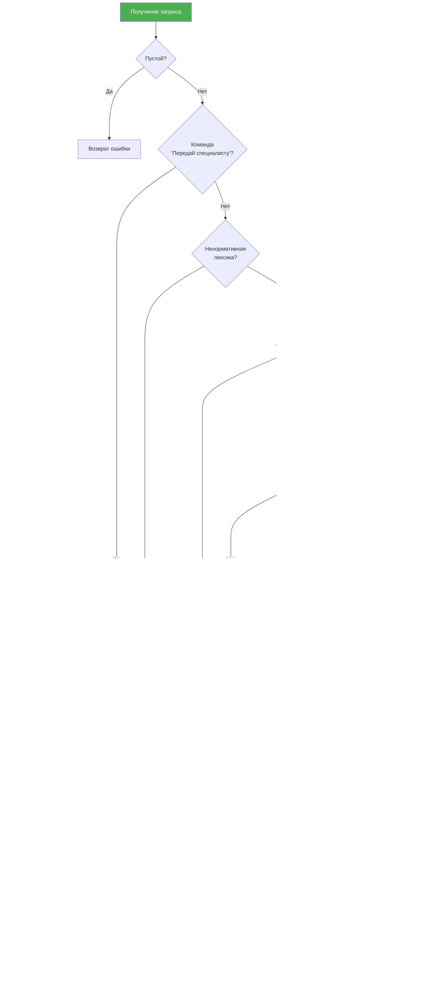
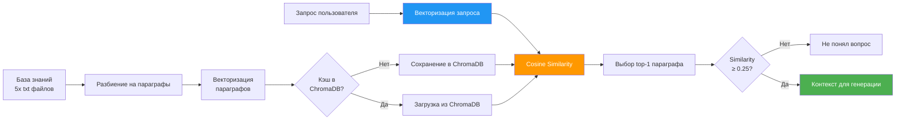
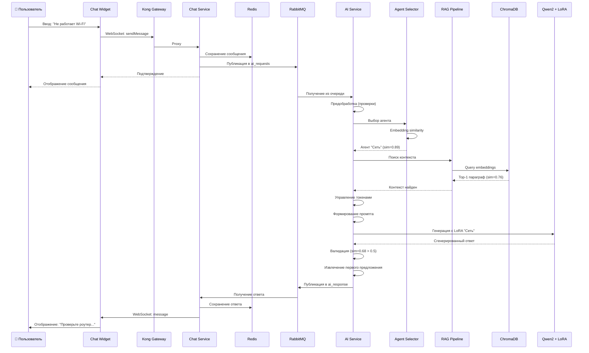

# Диаграмма компонентов мультиагентной системы

## 📐 Обзор архитектуры

Данный документ содержит детальное описание компонентов мультиагентной системы технической поддержки с RAG (Retrieval-Augmented Generation).

---

## 🎯 Ключевые компоненты

### 1. Оркестратор (Orchestrator)

**Файл:** `backend/ai-service/model.py` → функция `process_query()`

**Назначение:**
- Центральный координатор всех компонентов AI-системы
- Управление потоком обработки запросов
- Координация выбора агентов, RAG pipeline и генерации ответов

**Входные данные:**
```python
def process_query(
    query: str,                          # Запрос пользователя
    message_history: List[Dict] = None,  # История чата
    current_username: str = "Пользователь",
    chat_id: str = None
) -> Tuple[str, List[Dict]]:
```

**Основные функции:**

1. **Предварительная обработка запроса**
   - Проверка на пустые запросы
   - Детекция специальных команд ("Передай специалисту")
   - Фильтрация ненормативной лексики

2. **Классификация запроса**
   - Проверка на приветствия и общие фразы (similarity ≥ 0.7)
   - Выбор подходящего агента через embedding similarity
   - Fallback на базовую модель для общения

3. **Управление контекстом**
   - Динамический расчёт токенов (вопрос + история + контекст)
   - Обрезка истории при превышении лимита
   - Резервирование токенов для генерации (150 tokens)

4. **Координация генерации**
   - Загрузка LoRA адаптера выбранного агента
   - Формирование промпта с контекстом
   - Генерация и пост-обработка ответа

5. **Контроль качества**
   - Валидация релевантности (similarity с контекстом ≥ 0.5)
   - Автоматическая эскалация при низкой релевантности
   - Извлечение первого предложения из ответа

**Диаграмма потока:**



---

### 2. Агент-селектор (Agent Selector)

**Класс:** `ParagraphRetriever.select_agent()`

**Назначение:**
- Выбор наиболее подходящего специализированного агента для запроса
- Использует embedding-based similarity matching

**Алгоритм:**

```python
def select_agent(self, query: str) -> Tuple[Tokenizer, Model, str]:
    # 1. Векторизация запроса
    query_emb = embedding_model.encode(query, prompt_name="paraphrase")

    # 2. Векторизация названий агентов
    agent_names = ["Сеть", "Приложение", "Оборудование",
                   "Доступ и пароли", "Безопасность"]
    agent_embs = embedding_model.encode(agent_names, prompt_name="paraphrase")

    # 3. Вычисление cosine similarity
    similarities = cosine_similarity([query_emb], agent_embs)[0]

    # 4. Выбор агента с максимальным сходством
    max_idx = similarities.argmax()
    max_sim = similarities[max_idx]

    # 5. Проверка порога
    if max_sim < 0.25:
        return None, None, None  # Агент не найден

    selected_agent = agent_names[max_idx]
    return agent_tokenizer, agent_model, knowledge_base_file
```

**Специализированные агенты:**

| Агент | Область | LoRA адаптер | База знаний |
|-------|---------|--------------|-------------|
| 🌐 **Сеть** | Сетевые проблемы, Wi-Fi, интернет | `Сеть/best_model/` | `Сеть.txt` |
| 💻 **Приложение** | ПО, Office, браузеры | `Приложение/best_model/` | `Приложение.txt` |
| 🔧 **Оборудование** | Принтеры, компьютеры, периферия | `Оборудование/best_model/` | `Оборудование.txt` |
| 🔑 **Доступ и пароли** | Аутентификация, пароли, доступ | `Доступ и пароли/best_model/` | `Доступ и пароли.txt` |
| 🛡️ **Безопасность** | Вирусы, фишинг, защита данных | `Безопасность/best_model/` | `Безопасность.txt` |

**Пример работы:**

```python
# Запрос: "Как настроить Wi-Fi?"
query_emb = [0.23, -0.45, 0.67, ...]  # 384-мерный вектор

# Embedding агентов
agent_embs = [
    [0.25, -0.42, 0.70, ...],  # Сеть
    [0.10, -0.15, 0.05, ...],  # Приложение
    [0.05, -0.08, 0.12, ...],  # Оборудование
    [0.02, -0.03, 0.01, ...],  # Доступ
    [0.01, -0.02, 0.03, ...]   # Безопасность
]

# Cosine similarity
similarities = [0.92, 0.35, 0.28, 0.15, 0.12]

# Выбран: Сеть (similarity = 0.92)
```

---

### 3. RAG Pipeline (Retrieval-Augmented Generation)

**Компоненты:**

#### 3.1. Paragraph Retriever

**Класс:** `ParagraphRetriever` (наследует `BaseRetriever` из LangChain)

**Назначение:**
- Поиск наиболее релевантного параграфа из базы знаний
- Кэширование embeddings в ChromaDB

**Метод поиска:**

```python
def _get_relevant_documents(self, query: str) -> List[Document]:
    # 1. Векторизация запроса
    query_emb = embedding_model.encode(
        query,
        prompt_name="search_query",
        normalize_embeddings=True
    )

    # 2. Поиск по косинусному сходству
    paragraph_embs = self.paragraph_embeddings[current_agent]
    similarities = cosine_similarity([query_emb], paragraph_embs)[0]

    # 3. Выбор лучшего параграфа
    max_idx = similarities.argmax()
    max_sim = similarities[max_idx]

    # 4. Проверка порога релевантности
    if max_sim < 0.25:
        return [Document(page_content="Не понял вопрос, уточните!")]

    best_paragraph = self.paragraphs[current_agent][max_idx]
    return [Document(page_content=best_paragraph)]
```

#### 3.2. Embedding Model

**Модель:** `sentence-transformers/frida` (загружена локально)

**Характеристики:**
- Размерность: 384
- Тип: Sentence-BERT
- Промпты: `search_query`, `search_document`, `paraphrase`

**Использование:**

```python
# Для запросов пользователя
query_emb = emb_model.encode(query, prompt_name="search_query")

# Для параграфов из базы знаний
doc_emb = emb_model.encode(paragraph, prompt_name="search_document")

# Для сравнения фраз (приветствия, эскалация)
phrase_emb = emb_model.encode(phrase, prompt_name="paraphrase")
```

#### 3.3. Хранилище знаний (ChromaDB)

**Контейнер:** `chromadb:8000`

**Коллекция:** `paragraph_embeddings`

**Структура данных:**

```python
{
    "ids": ["Сеть_0", "Сеть_1", ..., "Безопасность_N"],
    "embeddings": [[0.23, -0.45, ...], [0.12, -0.33, ...], ...],
    "documents": ["Параграф 1", "Параграф 2", ...],
    "metadatas": [{"agent": "Сеть"}, {"agent": "Сеть"}, ...]
}
```

**Загрузка данных:**

```python
def load_all_paragraphs(self):
    for agent, config in agent_map.items():
        # Чтение файла базы знаний
        with open(config["file_path"], "r", encoding="utf-8") as f:
            text = f.read()

        # Разбиение на параграфы
        paragraphs = split_into_paragraphs(text)

        # Проверка кэша в ChromaDB
        existing_ids = collection.get(where={"agent": agent})["ids"]

        if not existing_ids:
            # Вычисление embeddings
            embeddings = emb_model.encode(
                paragraphs,
                prompt_name="search_document"
            )

            # Сохранение в ChromaDB
            for i, (para, emb) in enumerate(zip(paragraphs, embeddings)):
                collection.add(
                    documents=[para],
                    embeddings=[emb.tolist()],
                    ids=[f"{agent}_{i}"],
                    metadatas=[{"agent": agent}]
                )
        else:
            # Загрузка из ChromaDB
            results = collection.get(where={"agent": agent})
            self.paragraphs[agent] = results["documents"]
            self.paragraph_embeddings[agent] = np.array(results["embeddings"])
```

**Диаграмма RAG Pipeline:**



---

### 4. Генерация ответов (Generation Layer)

#### 4.1. Базовая модель (LLM)

**Модель:** Qwen2-7B (квантизированная)

**Параметры модели:**
```json
{
  "model_type": "qwen2",
  "num_parameters": "7B",
  "num_hidden_layers": 28,
  "hidden_size": 3584,
  "num_attention_heads": 28,
  "vocab_size": 151665,
  "max_position_embeddings": 32768,
  "quantization": {
    "method": "bitsandbytes",
    "bits": 4,
    "type": "nf4",
    "compute_dtype": "float16"
  }
}
```

**Память:**
- Оригинальная модель: ~14GB
- Квантизированная (4-bit): ~4-5GB VRAM

#### 4.2. LoRA адаптеры

**Конфигурация:**
```python
lora_config = LoraConfig(
    task_type=TaskType.CAUSAL_LM,
    r=64,                    # Ранг матриц LoRA
    lora_alpha=128,          # Коэффициент масштабирования
    lora_dropout=0.1,        # Dropout для регуляризации
    target_modules=["q_proj", "k_proj", "v_proj", "o_proj"]
)
```

**Параметры:**
- Обучаемые параметры на адаптер: ~33M (vs 7B базовой модели)
- Соотношение: 0.47% от базовой модели
- Размер файла адаптера: ~130MB

**Обучение:**

```python
# Файл: lora.py
training_args = TrainingArguments(
    output_dir="./lora_finetuned",
    per_device_train_batch_size=2,
    num_train_epochs=10,
    fp16=True,
    eval_strategy="steps",
    eval_steps=100,
    save_strategy="steps",
    load_best_model_at_end=True,
    metric_for_best_model="eval_loss"
)
```

**Переключение адаптеров:**

```python
# Загрузка базовой модели
base_model = AutoModelForCausalLM.from_pretrained("quantized_model")

# Загрузка LoRA адаптера для выбранного агента
selected_model = PeftModel.from_pretrained(
    base_model,
    f"{agent_name}/best_model"
)

# Генерация с адаптером
pipeline = pipeline(
    "text-generation",
    model=selected_model,
    tokenizer=selected_tokenizer,
    max_new_tokens=150,
    temperature=0.1,
    top_p=0.95,
    repetition_penalty=1.1
)
```

#### 4.3. Промпт-инженеринг

**Базовый промпт:**
```python
base_instruction = """Ты — помощник, который строго отвечает только на
основании предоставленного контекста и истории чата в одно предложение.
Если контекста нет, отвечай на общие вопросы как дружелюбный бот
(приветствия, прощания и т.д.)."""
```

**Формирование полного промпта:**

```python
def render_chat_with_context(history, question, context, username):
    messages = [
        {"role": "Система", "content": base_instruction +
         ("\nКонтекст: " + context if context else "")}
    ]

    # Добавление истории
    for msg in history:
        messages.append({
            "role": msg.get("username"),
            "content": msg["message"]
        })

    # Добавление текущего вопроса
    messages.append({"role": username, "content": question})

    # Форматирование
    prompt = "\n".join([f"{m['role']}: {m['content']}"
                        for m in messages]) + "\nAI-помощник:"

    return prompt
```

**Пример промпта:**

```
Система: Ты — помощник, который строго отвечает только на основании
предоставленного контекста и истории чата в одно предложение.
Контекст: Для настройки Wi-Fi откройте настройки сети, выберите доступную
сеть Wi-Fi, введите пароль и нажмите "Подключить".

Пользователь: Как настроить Wi-Fi?
AI-помощник:
```

**Генерация:**
```python
generated = pipeline(prompt)
answer = generated[0]['generated_text'].strip()

# Извлечение первого предложения
sentences = list(sentenize(answer))  # razdel library
first_sentence = sentences[0].text if sentences else answer
```

---

### 5. Очередь задач (Message Queue)

#### 5.1. RabbitMQ

**Контейнер:** `rabbitmq:5672`

**Очереди:**

| Очередь | Производитель | Потребитель | Назначение |
|---------|--------------|-------------|------------|
| `ai_requests` | Chat Service | AI Service | Запросы к AI |
| `ai_response` | AI Service | Chat Service | Ответы от AI |
| `db_messages` | Chat Service | Operator Service | Сохранение истории |

**Формат сообщений:**

```python
# ai_requests
{
    "chatId": "unique-chat-id",
    "message": "Как настроить принтер?",
    "username": "Пользователь",
    "messageHistory": [
        {"username": "Пользователь", "message": "Привет"},
        {"answer": "Здравствуйте!"}
    ]
}

# ai_response
{
    "chatId": "unique-chat-id",
    "answer": "Проверьте подключение принтера к сети...",
    "botUsername": "AI-помощник",
    "isManager": false  # true = эскалация к оператору
}
```

#### 5.2. Consumer в AI Service

```python
def callback(ch, method, properties, body):
    try:
        # Парсинг сообщения
        data = json.loads(body)
        query = data.get('message', '')
        message_history = data.get('messageHistory', [])
        chat_id = data.get('chatId')

        # Обработка запроса
        answer, new_history = process_query(
            query,
            message_history,
            current_username,
            chat_id
        )

        # Проверка на эскалацию
        is_manager = (answer == "Запрос передан специалисту.
                               Пожалуйста, подождите.")

        # Формирование ответа
        response = {
            'chatId': chat_id,
            'answer': answer,
            'botUsername': 'AI-помощник',
            'isManager': is_manager
        }

        # Публикация в ai_response
        ch.basic_publish(
            exchange='',
            routing_key='ai_response',
            body=json.dumps(response)
        )

        # Подтверждение обработки
        ch.basic_ack(delivery_tag=method.delivery_tag)

    except Exception as e:
        logger.error(f"Ошибка: {e}")
        ch.basic_nack(delivery_tag=method.delivery_tag, requeue=False)

# Подписка на очередь
channel.basic_consume(queue='ai_requests', on_message_callback=callback)
channel.start_consuming()
```

---

### 6. Интерфейсы

#### 6.1. Chat Widget (Frontend)

**Технологии:** React + Socket.IO

**Подключение:**
```javascript
const socket = io('http://localhost:8000', {
  path: '/socket.io',
  transports: ['websocket', 'polling']
});
```

**Основные события:**

```javascript
// Присоединение к чату
socket.emit('joinChat', {
  chatId: chatId,
  username: username
});

// Отправка сообщения
socket.emit('sendMessage', {
  chatId: chatId,
  message: message,
  username: username
});

// Получение сообщения
socket.on('message', (data) => {
  appendMessage(data.username, data.message);
});

// Получение истории
socket.on('messageHistory', (messages) => {
  renderHistory(messages);
});
```

#### 6.2. Chat Service (Backend)

**Технологии:** NestJS + Socket.IO

**Gateway:**
```typescript
@WebSocketGateway({
  cors: { origin: '*' }
})
export class ChatGateway {
  @SubscribeMessage('sendMessage')
  async handleMessage(client: Socket, payload: any) {
    const { chatId, message, username } = payload;

    // Сохранение в Redis
    await this.redisService.saveMessage(chatId, {
      username,
      message,
      timestamp: new Date()
    });

    // Получение истории
    const history = await this.redisService.getHistory(chatId);

    // Публикация в RabbitMQ
    await this.rabbitmqService.publishToAI({
      chatId,
      message,
      username,
      messageHistory: history
    });

    // Broadcast в комнату
    this.server.to(chatId).emit('message', {
      chatId,
      message,
      username,
      timestamp: new Date()
    });
  }

  @SubscribeMessage('joinChat')
  handleJoinChat(client: Socket, payload: any) {
    const { chatId } = payload;
    client.join(chatId);

    // Отправка истории
    const history = await this.redisService.getHistory(chatId);
    client.emit('messageHistory', history);
  }
}
```

#### 6.3. Redis Service

**Назначение:** Кэширование истории чата

```typescript
export class RedisService {
  async saveMessage(chatId: string, message: any) {
    const key = `chat:${chatId}:messages`;
    await this.redis.rpush(key, JSON.stringify(message));
    await this.redis.ltrim(key, -50, -1);  // Хранить последние 50
  }

  async getHistory(chatId: string): Promise<any[]> {
    const key = `chat:${chatId}:messages`;
    const messages = await this.redis.lrange(key, 0, -1);
    return messages.map(m => JSON.parse(m));
  }
}
```

---

## 🔄 Полный цикл обработки запроса



---

## 📊 Статистика системы

### Размеры компонентов

| Компонент | Размер | Тип |
|-----------|--------|-----|
| Базовая модель Qwen2-7B (4-bit) | ~4GB | Model weights |
| LoRA адаптер (1 шт) | ~130MB | Adapter weights |
| Embedding модель (frida) | ~420MB | Model weights |
| База знаний (5 файлов) | ~250KB | Text files |
| Embeddings в ChromaDB | ~20MB | Vector DB |
| Docker images (общий) | ~15GB | Containers |

### Производительность

| Метрика | Значение | Условия |
|---------|----------|---------|
| Время ответа (avg) | 2-5 секунд | GPU inference |
| Время ответа (avg) | 15-30 секунд | CPU inference |
| Throughput | ~10 req/min | Single GPU |
| Latency (embedding) | ~50ms | Batch size 1 |
| Latency (generation) | 1-4 сек | max_tokens=150 |

### Требования к ресурсам

**Минимальные (CPU):**
- RAM: 16GB
- Disk: 30GB
- CPU: 4 cores

**Рекомендуемые (GPU):**
- RAM: 16GB
- Disk: 50GB
- GPU: 8GB VRAM (NVIDIA)
- CPU: 8 cores

---

## 🎓 Ключевые технологии

### AI/ML Stack
- **PyTorch** - Deep learning framework
- **Transformers** - Hugging Face библиотека
- **PEFT** - Parameter-Efficient Fine-Tuning (LoRA)
- **Sentence-Transformers** - Embedding models
- **LangChain** - RAG framework
- **ChromaDB** - Vector database

### Backend Stack
- **Python 3.9+** - AI Service
- **NestJS** - Chat Service
- **Go (Fiber)** - Operator Service
- **RabbitMQ** - Message broker
- **Redis** - Cache
- **PostgreSQL** - Relational DB

### Infrastructure
- **Docker Compose** - Orchestration
- **Kong** - API Gateway
- **Prometheus** - Metrics
- **Grafana** - Visualization
- **Loki** - Logging

---

**Последнее обновление:** 2024-10-18
