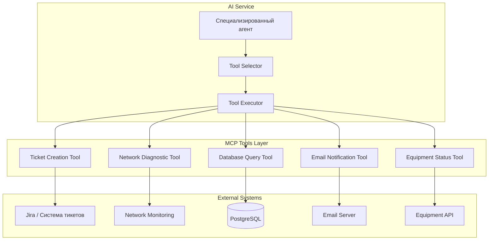

# Спецификация MCP-серверов и инструментов

## 📋 Обзор

Данный документ описывает MCP (Model Context Protocol) серверы и инструменты, используемые в мультиагентной системе технической поддержки.

**Текущий статус:** MCP-инструменты пока не реализованы в системе, но архитектура готова для их интеграции.

---

## 🎯 Концепция MCP-инструментов

### Что такое MCP Tools?

**MCP (Model Context Protocol) Tools** - это инструменты, которые позволяют агентам выполнять действия:
- Создание тикетов в системе поддержки
- Проверка статуса оборудования
- Запросы к базам данных
- Выполнение диагностических команд
- Интеграция с внешними API

### Архитектура интеграции



---

## 🛠️ Спецификация MCP-инструментов

### 1. Ticket Creation Tool

**Назначение:** Создание тикета в системе поддержки

**Функция:** `create_ticket`

#### Сигнатура

```python
def create_ticket(
    title: str,
    description: str,
    priority: Literal["low", "medium", "high", "critical"],
    category: str,
    user_id: Optional[str] = None,
    tags: Optional[List[str]] = None
) -> Dict[str, Any]:
    """
    Создаёт тикет в системе технической поддержки.

    Args:
        title: Заголовок тикета (макс. 200 символов)
        description: Подробное описание проблемы
        priority: Приоритет тикета
        category: Категория (Network, Application, Hardware, Access, Security)
        user_id: ID пользователя (опционально)
        tags: Теги для классификации

    Returns:
        {
            "ticket_id": str,
            "status": str,
            "created_at": str (ISO 8601),
            "assigned_to": Optional[str],
            "estimated_resolution": Optional[str]
        }

    Raises:
        TicketCreationError: Если не удалось создать тикет
        ValidationError: Если параметры невалидны
    """
```

#### Параметры

| Параметр | Тип | Обязательный | Ограничения | Пример |
|----------|-----|--------------|-------------|--------|
| `title` | string | ✅ Да | 10-200 символов | "Не работает Wi-Fi в офисе" |
| `description` | string | ✅ Да | 20-2000 символов | "Пользователь не может подключиться..." |
| `priority` | enum | ✅ Да | low, medium, high, critical | "high" |
| `category` | string | ✅ Да | См. список категорий | "Network" |
| `user_id` | string | ❌ Нет | UUID формат | "user_12345" |
| `tags` | array[string] | ❌ Нет | Макс. 10 тегов | ["wifi", "urgent"] |

#### Категории

| Категория | Агент | Примеры проблем |
|-----------|-------|-----------------|
| `Network` | Сеть | Wi-Fi, интернет, VPN, роутеры |
| `Application` | Приложение | Office, браузеры, корпоративное ПО |
| `Hardware` | Оборудование | Принтеры, мониторы, клавиатуры |
| `Access` | Доступ и пароли | Пароли, доступы, аккаунты |
| `Security` | Безопасность | Вирусы, фишинг, подозрительная активность |

#### Примеры вызовов

**Пример 1: Создание тикета высокого приоритета**

```python
result = create_ticket(
    title="Не работает корпоративная почта",
    description="Пользователь не может отправить письма через Outlook. Ошибка: Connection timeout.",
    priority="high",
    category="Application",
    user_id="user_12345",
    tags=["outlook", "email", "urgent"]
)

# Response:
{
    "ticket_id": "TICKET-001234",
    "status": "open",
    "created_at": "2024-10-18T10:30:00Z",
    "assigned_to": "support_team_1",
    "estimated_resolution": "2024-10-18T14:00:00Z"
}
```

**Пример 2: Автоматическое создание при эскалации**

```python
# Когда AI не может решить проблему
if similarity < 0.5:
    ticket = create_ticket(
        title=f"Эскалация: {user_query[:100]}",
        description=f"AI не смогла решить запрос:\n\n{user_query}\n\nКонтекст: {context}",
        priority="medium",
        category=selected_agent_category,
        tags=["ai_escalation", "requires_human"]
    )
    return f"Запрос передан специалисту. Номер тикета: {ticket['ticket_id']}"
```

#### Ограничения

- ⏱️ **Rate limit:** 100 тикетов/час на пользователя
- 📊 **Quota:** 10,000 тикетов/день для всей системы
- ⏳ **Timeout:** 30 секунд
- 🔄 **Retry:** До 3 попыток при сбоях

---

### 2. Network Diagnostic Tool

**Назначение:** Проверка сетевой диагностики

**Функция:** `check_network_status`

#### Сигнатура

```python
def check_network_status(
    target: str,
    check_type: Literal["ping", "traceroute", "port_scan"],
    user_location: Optional[str] = None
) -> Dict[str, Any]:
    """
    Выполняет сетевую диагностику.

    Args:
        target: IP адрес, hostname или URL
        check_type: Тип проверки
        user_location: Локация пользователя (для определения сетевого сегмента)

    Returns:
        {
            "status": str,  # "online", "offline", "degraded"
            "latency_ms": Optional[float],
            "packet_loss_percent": Optional[float],
            "details": Dict[str, Any]
        }

    Raises:
        NetworkDiagnosticError: Если проверка не удалась
    """
```

#### Параметры

| Параметр | Тип | Обязательный | Ограничения | Пример |
|----------|-----|--------------|-------------|--------|
| `target` | string | ✅ Да | IP, hostname, URL | "192.168.1.1" |
| `check_type` | enum | ✅ Да | ping, traceroute, port_scan | "ping" |
| `user_location` | string | ❌ Нет | Офис/здание | "office_moscow_1" |

#### Примеры вызовов

**Пример 1: Проверка доступности роутера**

```python
result = check_network_status(
    target="192.168.1.1",
    check_type="ping",
    user_location="office_moscow_1"
)

# Response:
{
    "status": "online",
    "latency_ms": 2.3,
    "packet_loss_percent": 0.0,
    "details": {
        "packets_sent": 4,
        "packets_received": 4,
        "min_latency_ms": 1.8,
        "max_latency_ms": 3.1,
        "avg_latency_ms": 2.3
    }
}
```

**Пример 2: Диагностика проблем с интернетом**

```python
result = check_network_status(
    target="8.8.8.8",  # Google DNS
    check_type="ping"
)

# Response (проблема):
{
    "status": "offline",
    "latency_ms": null,
    "packet_loss_percent": 100.0,
    "details": {
        "error": "Request timed out",
        "recommendation": "Проверьте подключение к роутеру"
    }
}
```

#### Ограничения

- ⏱️ **Rate limit:** 50 проверок/час на пользователя
- ⏳ **Timeout:** 10 секунд
- 🔒 **Security:** Только разрешённые IP-адреса и порты

---

### 3. Database Query Tool

**Назначение:** Запросы к базе данных знаний и тикетов

**Функция:** `query_database`

#### Сигнатура

```python
def query_database(
    query_type: Literal["search_tickets", "get_user_history", "get_stats"],
    filters: Dict[str, Any],
    limit: int = 10
) -> Dict[str, Any]:
    """
    Выполняет запрос к базе данных.

    Args:
        query_type: Тип запроса
        filters: Фильтры для поиска
        limit: Максимальное количество результатов

    Returns:
        {
            "results": List[Dict],
            "total_count": int,
            "query_time_ms": float
        }

    Raises:
        DatabaseQueryError: Если запрос не удался
    """
```

#### Параметры

| Параметр | Тип | Обязательный | Ограничения | Пример |
|----------|-----|--------------|-------------|--------|
| `query_type` | enum | ✅ Да | См. типы запросов | "search_tickets" |
| `filters` | object | ✅ Да | JSON object | `{"status": "open"}` |
| `limit` | integer | ❌ Нет | 1-100, default=10 | 20 |

#### Типы запросов

| Тип | Описание | Фильтры |
|-----|----------|---------|
| `search_tickets` | Поиск тикетов | status, category, priority, user_id, date_range |
| `get_user_history` | История пользователя | user_id, date_range, category |
| `get_stats` | Статистика | date_range, category, agent |

#### Примеры вызовов

**Пример 1: Поиск похожих тикетов**

```python
result = query_database(
    query_type="search_tickets",
    filters={
        "category": "Network",
        "status": "resolved",
        "keywords": ["wifi", "не подключается"]
    },
    limit=5
)

# Response:
{
    "results": [
        {
            "ticket_id": "TICKET-001100",
            "title": "Не подключается Wi-Fi на ноутбуке",
            "resolution": "Обновлены драйверы сетевой карты",
            "resolved_at": "2024-10-15T14:30:00Z"
        },
        ...
    ],
    "total_count": 87,
    "query_time_ms": 45.3
}
```

**Пример 2: История обращений пользователя**

```python
result = query_database(
    query_type="get_user_history",
    filters={
        "user_id": "user_12345",
        "date_range": {
            "from": "2024-10-01",
            "to": "2024-10-18"
        }
    },
    limit=10
)

# Response:
{
    "results": [
        {
            "date": "2024-10-17",
            "category": "Application",
            "issue": "Outlook не отправляет письма",
            "status": "resolved"
        },
        {
            "date": "2024-10-10",
            "category": "Network",
            "issue": "Медленный интернет",
            "status": "resolved"
        }
    ],
    "total_count": 2,
    "query_time_ms": 12.1
}
```

#### Ограничения

- ⏱️ **Rate limit:** 200 запросов/час
- ⏳ **Timeout:** 5 секунд
- 📊 **Max results:** 100 записей за запрос

---

### 4. Email Notification Tool

**Назначение:** Отправка email уведомлений

**Функция:** `send_email_notification`

#### Сигнатура

```python
def send_email_notification(
    recipient: str,
    subject: str,
    body: str,
    template: Optional[str] = None,
    attachments: Optional[List[str]] = None
) -> Dict[str, Any]:
    """
    Отправляет email уведомление.

    Args:
        recipient: Email получателя
        subject: Тема письма
        body: Текст письма (поддерживает HTML)
        template: Имя шаблона (опционально)
        attachments: Пути к файлам для вложения

    Returns:
        {
            "message_id": str,
            "status": str,  # "sent", "queued", "failed"
            "sent_at": str
        }

    Raises:
        EmailSendError: Если не удалось отправить
    """
```

#### Параметры

| Параметр | Тип | Обязательный | Ограничения | Пример |
|----------|-----|--------------|-------------|--------|
| `recipient` | string | ✅ Да | Valid email | "user@company.com" |
| `subject` | string | ✅ Да | 1-200 символов | "Ваш тикет решён" |
| `body` | string | ✅ Да | 1-10000 символов | "Здравствуйте!..." |
| `template` | string | ❌ Нет | Имя шаблона | "ticket_resolved" |
| `attachments` | array[string] | ❌ Нет | Макс. 5 файлов, 10MB | ["/path/file.pdf"] |

#### Примеры вызовов

**Пример 1: Уведомление о создании тикета**

```python
result = send_email_notification(
    recipient="user@company.com",
    subject="Тикет #TICKET-001234 создан",
    template="ticket_created",
    body=f"""
    Здравствуйте!

    Ваш запрос зарегистрирован под номером TICKET-001234.
    Описание: Не работает корпоративная почта

    Ожидаемое время решения: 4 часа

    С уважением,
    Служба поддержки
    """
)

# Response:
{
    "message_id": "msg_abc123xyz",
    "status": "sent",
    "sent_at": "2024-10-18T10:35:00Z"
}
```

#### Ограничения

- ⏱️ **Rate limit:** 50 писем/час на получателя
- 📨 **Daily quota:** 1000 писем/день
- 📎 **Attachments:** Макс. 5 файлов, 10MB total

---

### 5. Equipment Status Tool

**Назначение:** Проверка статуса оборудования

**Функция:** `check_equipment_status`

#### Сигнатура

```python
def check_equipment_status(
    equipment_id: str,
    equipment_type: Literal["printer", "computer", "monitor", "server"],
    detailed: bool = False
) -> Dict[str, Any]:
    """
    Проверяет статус оборудования.

    Args:
        equipment_id: ID оборудования
        equipment_type: Тип оборудования
        detailed: Подробная информация

    Returns:
        {
            "status": str,  # "online", "offline", "error", "maintenance"
            "location": str,
            "last_activity": str,
            "details": Optional[Dict]
        }

    Raises:
        EquipmentNotFoundError: Если оборудование не найдено
    """
```

#### Примеры вызовов

**Пример 1: Проверка принтера**

```python
result = check_equipment_status(
    equipment_id="printer_office_1_floor2",
    equipment_type="printer",
    detailed=True
)

# Response:
{
    "status": "error",
    "location": "Офис 1, 2 этаж",
    "last_activity": "2024-10-18T09:15:00Z",
    "details": {
        "error_code": "PAPER_JAM",
        "paper_level": 0,
        "toner_level": 75,
        "queue_size": 5
    }
}
```

#### Ограничения

- ⏱️ **Rate limit:** 100 проверок/час
- ⏳ **Timeout:** 5 секунд

---

## 🔧 Интеграция с агентами

### Пример использования инструментов в агентах

```python
from langchain.tools import BaseTool
from typing import List

class AgentWithTools:
    def __init__(self, agent_name: str, tools: List[BaseTool]):
        self.agent_name = agent_name
        self.tools = tools

    def process_with_tools(self, query: str, context: str):
        # 1. Генерация ответа с RAG
        answer = self.generate_answer(query, context)

        # 2. Определение необходимости инструмента
        if self.requires_ticket_creation(query, answer):
            # Создание тикета
            ticket = self.tools['create_ticket'].run(
                title=query[:100],
                description=f"Query: {query}\n\nContext: {context}",
                priority="medium",
                category=self.agent_name
            )
            answer += f"\n\nТикет создан: {ticket['ticket_id']}"

        elif self.requires_network_check(query):
            # Проверка сети
            status = self.tools['check_network'].run(
                target="192.168.1.1",
                check_type="ping"
            )
            if status['status'] == 'offline':
                answer = "Обнаружена проблема с сетью. Роутер недоступен. Создаю тикет..."

        return answer
```

### Привязка инструментов к агентам

| Агент | Рекомендуемые инструменты |
|-------|---------------------------|
| **Сеть** | Network Diagnostic, Equipment Status (routers), Ticket Creation |
| **Приложение** | Database Query (similar issues), Email Notification, Ticket Creation |
| **Оборудование** | Equipment Status, Ticket Creation, Email Notification |
| **Доступ и пароли** | Database Query (user history), Ticket Creation, Email Notification |
| **Безопасность** | Ticket Creation (high priority), Email Notification, Database Query |

---

## 📊 Модель данных MCP Tools

### Tool Invocation Log

```python
class ToolInvocation:
    """Лог вызова инструмента"""
    invocation_id: str          # UUID
    timestamp: datetime
    agent_name: str             # Какой агент вызвал
    tool_name: str              # Название инструмента
    parameters: Dict[str, Any]  # Параметры вызова
    result: Dict[str, Any]      # Результат
    duration_ms: float          # Время выполнения
    status: str                 # "success", "error", "timeout"
    error_message: Optional[str]
```

### Tool Configuration

```python
class ToolConfig:
    """Конфигурация инструмента"""
    tool_name: str
    enabled: bool = True
    rate_limit_per_hour: int = 100
    timeout_seconds: int = 30
    retry_attempts: int = 3
    required_permissions: List[str] = []
    allowed_agents: List[str] = []  # Пустой список = все агенты
```

---

## 🔐 Безопасность MCP Tools

### Аутентификация и авторизация

```python
class ToolSecurityManager:
    def check_permission(
        self,
        agent_name: str,
        tool_name: str,
        user_id: Optional[str]
    ) -> bool:
        """Проверка разрешений на использование инструмента"""
        # 1. Проверка: агент разрешён для инструмента
        if not self.is_agent_allowed(agent_name, tool_name):
            raise PermissionDenied(f"{agent_name} cannot use {tool_name}")

        # 2. Проверка: не превышен rate limit
        if not self.check_rate_limit(agent_name, tool_name):
            raise RateLimitExceeded(f"Rate limit exceeded for {tool_name}")

        # 3. Проверка: пользователь имеет права (если требуется)
        if user_id and not self.check_user_permission(user_id, tool_name):
            raise PermissionDenied(f"User {user_id} not authorized")

        return True
```

### Rate Limiting

```python
class RateLimiter:
    def __init__(self, redis_client):
        self.redis = redis_client

    def check_limit(
        self,
        key: str,
        limit: int,
        window_seconds: int = 3600
    ) -> bool:
        """Проверка rate limit с использованием Redis"""
        current = self.redis.get(key)

        if current is None:
            self.redis.setex(key, window_seconds, 1)
            return True

        if int(current) >= limit:
            return False

        self.redis.incr(key)
        return True
```

---

## 📈 Мониторинг MCP Tools

### Метрики (Prometheus)

```python
from prometheus_client import Counter, Histogram

# Счётчики вызовов
tool_invocations_total = Counter(
    'mcp_tool_invocations_total',
    'Total MCP tool invocations',
    ['tool_name', 'agent_name', 'status']
)

# Время выполнения
tool_duration_seconds = Histogram(
    'mcp_tool_duration_seconds',
    'MCP tool execution duration',
    ['tool_name']
)

# Ошибки
tool_errors_total = Counter(
    'mcp_tool_errors_total',
    'Total MCP tool errors',
    ['tool_name', 'error_type']
)
```

### Логирование

```python
import logging

logger = logging.getLogger(__name__)

def execute_tool_with_logging(tool_name, params):
    logger.info(f"Executing tool: {tool_name}", extra={
        "tool_name": tool_name,
        "parameters": params,
        "agent": current_agent
    })

    start_time = time.time()

    try:
        result = tool.run(**params)
        duration = time.time() - start_time

        logger.info(f"Tool executed successfully: {tool_name}", extra={
            "duration_ms": duration * 1000,
            "result_size": len(str(result))
        })

        return result

    except Exception as e:
        logger.error(f"Tool execution failed: {tool_name}", extra={
            "error": str(e),
            "error_type": type(e).__name__
        }, exc_info=True)
        raise
```

---

## 🚀 Roadmap для внедрения MCP Tools

### Phase 1: Базовые инструменты (MVP)
- ✅ Ticket Creation Tool
- ✅ Email Notification Tool
- ⚠️ Интеграция с Jira/ServiceDesk

### Phase 2: Диагностические инструменты
- ❌ Network Diagnostic Tool
- ❌ Equipment Status Tool
- ❌ Database Query Tool

### Phase 3: Расширенные возможности
- ❌ Automated Resolution Tool (auto-fix)
- ❌ Knowledge Base Update Tool
- ❌ User Feedback Collection Tool

### Phase 4: ML-enhanced Tools
- ❌ Predictive Maintenance Tool
- ❌ Smart Escalation Tool
- ❌ Auto-categorization Tool

---

## 📚 Примеры реализации

### Пример 1: LangChain BaseTool

```python
from langchain.tools import BaseTool
from typing import Type
from pydantic import BaseModel, Field

class TicketCreationInput(BaseModel):
    title: str = Field(description="Заголовок тикета")
    description: str = Field(description="Описание проблемы")
    priority: str = Field(description="Приоритет: low, medium, high")

class TicketCreationTool(BaseTool):
    name = "create_ticket"
    description = """Создаёт тикет в системе поддержки.
    Используй когда:
    - Проблема не может быть решена автоматически
    - Требуется вмешательство специалиста
    - Пользователь явно запросил создание тикета
    """
    args_schema: Type[BaseModel] = TicketCreationInput

    def _run(self, title: str, description: str, priority: str) -> str:
        # Вызов API системы тикетов
        ticket_id = api_client.create_ticket(title, description, priority)
        return f"Создан тикет #{ticket_id}"

    async def _arun(self, *args, **kwargs):
        # Асинхронная версия
        raise NotImplementedError("Async not implemented")
```

### Пример 2: Использование в агенте

```python
from langchain.agents import initialize_agent, AgentType

# Инициализация инструментов
tools = [
    TicketCreationTool(),
    NetworkDiagnosticTool(),
    EmailNotificationTool()
]

# Создание агента с инструментами
agent = initialize_agent(
    tools=tools,
    llm=selected_model,
    agent=AgentType.ZERO_SHOT_REACT_DESCRIPTION,
    verbose=True
)

# Запрос с использованием инструментов
response = agent.run(
    "Пользователь не может подключиться к Wi-Fi. Проверь сеть и создай тикет если нужно."
)
```

---

**Последнее обновление:** 2024-10-18
**Статус:** Архитектура готова, реализация планируется
